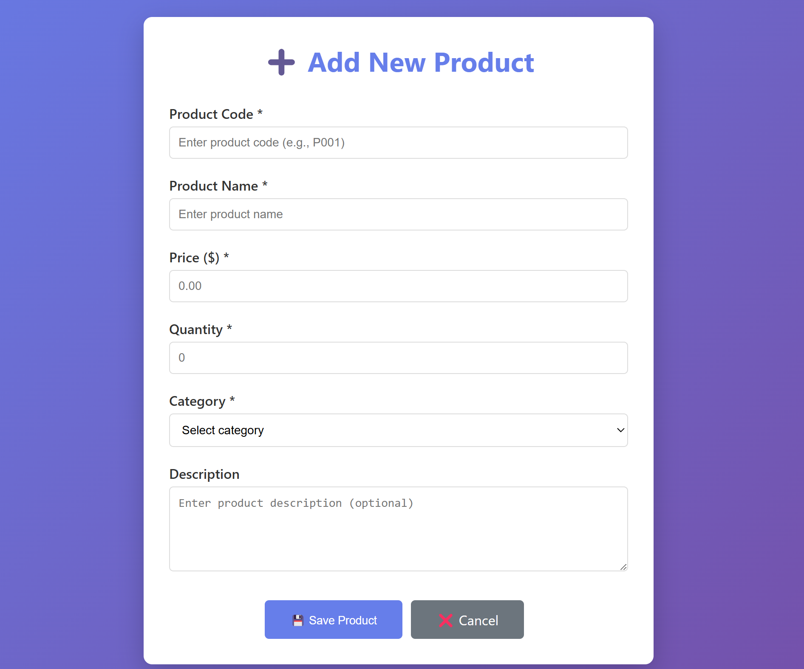
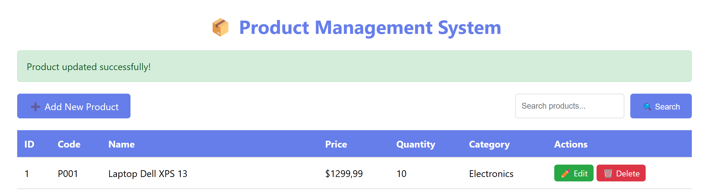
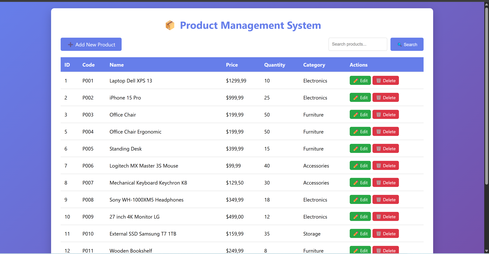
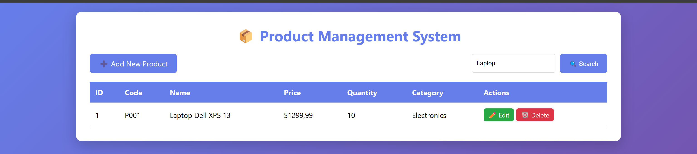
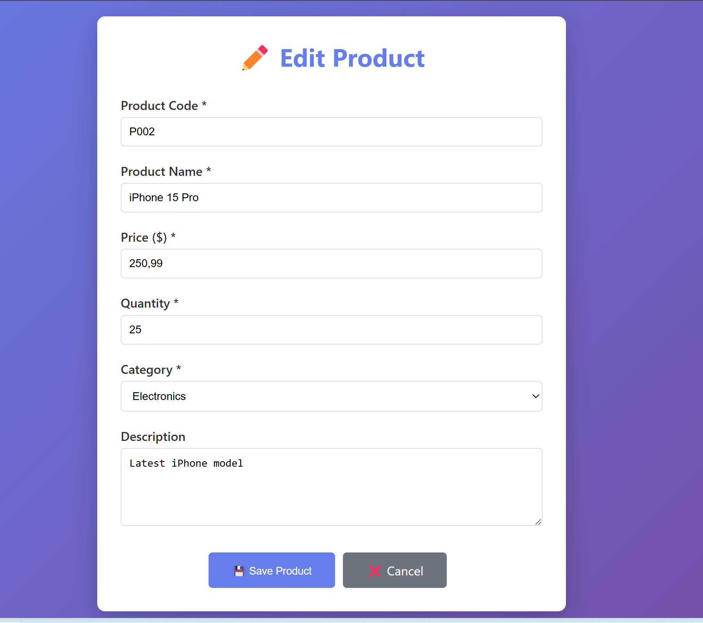
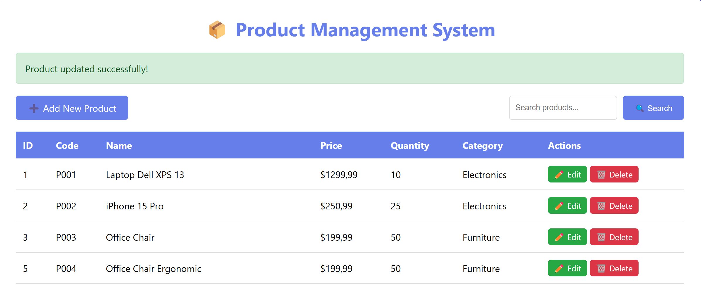
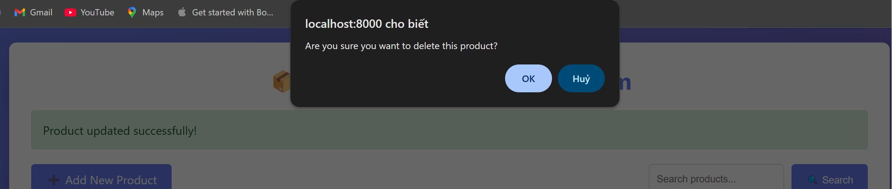
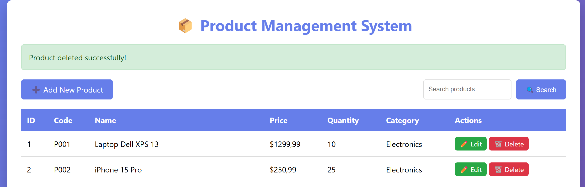

# Web-Application-Development-Lab-07

## NGUYEN VIET THAO - ITCSIU23058 

## Product Management System - CRUD Flow Report

### 1️⃣ CREATE

#### **Activity flow:**

**Phase 1: Display new creation form**
```
GET /products/new 
↓
ProductController.showNewForm() 
↓
Create an empty Product object 
↓
Return "product-form.html"
```

**Phase 2: Save data**
```
POST /products/save 
↓
ProductController.saveProduct(@ModelAttribute Product) 
↓
ProductService.saveProduct(product) 
↓
ProductRepository.save(product) [id = null → INSERT] 
↓
Database: INSERT INTO products (...) 
↓
@PrePersist: Set createdAt = LocalDateTime.now() 
↓
Flash Message: "Product added successfully!" 
↓
Redirect → GET /products
```

#### **Code Implementation:**

**Controller: `ProductController.java`**
```java
@GetMapping("/new")
public String showNewForm(Model model) { 
Product product = new Product(); 
model.addAttribute("product", product); 
return "product-form";
}

@PostMapping("/save")
public String saveProduct(@ModelAttribute("product") Product product, 
RedirectAttributes redirectAttributes) { 
try { 
productService.saveProduct(product); 
redirectAttributes.addFlashAttribute("message", 
product.getId() == null ? "Product added successfully!" 
: "Product updated successfully!"); 
} catch (Exception e) { 
redirectAttributes.addFlashAttribute("error", 
"Error saving product: " + e.getMessage()); 
} 
return "redirect:/products";
}
```

**Service: `ProductServiceImpl.java`**
```java
@Override
public Product saveProduct(Product product) { 
return productRepository.save(product);
}
```

**Entity Lifecycle: `Product.java`**
```java
@PrePersist
protected void onCreate() { 
this.createdAt = LocalDateTime.now();
}
```

#### **Output:**

**Create:**


**After Create:**


---

### 2️⃣ READ - Read and display data

#### **Activity flow:**

**List All Products:**
```
GET /products 
↓
ProductController.listProducts(Model) 
↓
ProductService.getAllProducts() 
↓
ProductRepository.findAll() 
↓
Database: SELECT * FROM products 
↓
Return List<Product> 
↓
Model.addAttribute("products", productList) 
↓
Return "product-list.html" 
↓
Thymeleaf renders table with data
```

**Get Product by ID (for Edit):**
```
GET /products/edit/{id} 
↓
ProductController.showEditForm(@PathVariable Long id) 
↓
ProductService.getProductById(id) 
↓
ProductRepository.findById(id) → Optional<Product> 
↓
Database: SELECT * FROM products WHERE id = ? 
↓
If present: Return product form
If empty: Redirect with error message
```

**Search Products:**
```
GET /products/search?keyword={keyword} 
↓
ProductController.searchProducts(@RequestParam String keyword) 
↓
ProductService.searchProducts(keyword) 
↓
ProductRepository.findByNameContaining(keyword) 
↓
Database: SELECT * FROM products WHERE name LIKE %keyword% 
↓
Return filtered list
```

#### **Code Implementation:**

**Controller: `ProductController.java`**
```java
@GetMapping
public String listProducts(Model model) { 
List<Product> products = productService.getAllProducts(); 
model.addAttribute("products", products); 
return "product-list";
}

@GetMapping("/edit/{id}")
public String showEditForm(@PathVariable Long id, Model model, 
RedirectAttributes redirectAttributes) { 
return productService.getProductById(id) 
.map(product -> { 
model.addAttribute("product", product); 
return "product-form"; 
}) 
.orElseGet(() -> { 
redirectAttributes.addFlashAttribute("error", 
"Product not found"); 
return "redirect:/products"; 
});
}

@GetMapping("/search")
public String searchProducts(@RequestParam("keyword") String keyword, 
Model model) { 
List<Product> products = productService.searchProducts(keyword); 
model.addAttribute("products", products); 
model.addAttribute("keyword", keyword); 
return "product-list";
}
```

**Service: `ProductServiceImpl.java`**
```java
@Override
public List<Product> getAllProducts() { 
return productRepository.findAll();
}

@Override
public Optional<Product> getProductById(Long id) { 
return productRepository.findById(id);
}

@Override
public List<Product> searchProducts(String keyword) { 
return productRepository.findByNameContaining(keyword);
}
```

**Repository: `ProductRepository.java`**
```java
List<Product> findByNameContaining(String keyword);
```

#### **Output:**

**List:**



**Search:**


---
### 3️⃣ UPDATE - Update product

#### **Activity flow:**

**Phase 1: Load current data**
```
GET /products/edit/{id} 
↓
ProductController.showEditForm(@PathVariable id) 
↓
ProductService.getProductById(id) 
↓
ProductRepository.findById(id) 
↓
Database: SELECT * FROM products WHERE id = ? 
↓
Model.addAttribute("product", existingProduct) 
↓
Return "product-form.html" with the data filled in
```

**Phase 2: Update data**
```
POST /products/save (with id in hidden field) 
↓
ProductController.saveProduct(@ModelAttribute Product) 
↓
Product object has id != null 
↓
ProductService.saveProduct(product) 
↓
ProductRepository.save(product) [id != null → UPDATE] 
↓
Database: UPDATE products SET ... WHERE id = ? 
↓
Flash Message: "Product updated successfully!" 
↓
Redirect → GET /products
```
#### **Code Implementation:**
1. **JPA Smart Save**: JPA's `save()` method automatically distinguishes:

- `id == null` → Perform INSERT

- `id != null` → Perform UPDATE

2. **Hidden Input Field**: Form contains hidden input to hold ID:
```html
<input type="hidden" th:field="*{id}" />
```

3. **Conditional Message**: Controller checks ID to display appropriate message:
```java
product.getId() == null ? "Product added successfully!"
: "Product updated successfully!"
```

#### **Output:**

**Update:**



**After Update:**


---

### 4️⃣ DELETE - Delete the product

#### **Activity flow:**

```
GET /products/delete/{id} 
↓
JavaScript: confirm("Are you sure...?") 
↓
ProductController.deleteProduct(@PathVariable id) 
↓
ProductService.deleteProduct(id) 
↓
ProductRepository.deleteById(id) 
↓
Database: DELETE FROM products WHERE id = ? 
↓
Flash Message: "Product deleted successfully!" 
↓
Redirect → GET /products
```

#### **Code Implementation:**

**Controller: `ProductController.java`**
```java
@GetMapping("/delete/{id}")
public String deleteProduct(@PathVariable Long id, 
RedirectAttributes redirectAttributes) { 
try { 
productService.deleteProduct(id); 
redirectAttributes.addFlashAttribute("message", 
"Product deleted successfully!"); 
} catch (Exception e) { 
redirectAttributes.addFlashAttribute("error", 
"Error deleting product: " + e.getMessage()); 
} 
return "redirect:/products";
}
```

**Service: `ProductServiceImpl.java`**
```java
@Override
public void deleteProduct(Long id) { 
productRepository.deleteById(id);
}
```

**View: `product-list.html`**
```html
<a th:href="@{/products/delete/{id}(id=${product.id})}" 
class="btn btn-danger btn-sm" 
onclick="return confirm('Are you sure you want to delete this product?')"> 
🗑️ Delete
</a>
```

#### **Output:**

**Delete Confirmation:**



**After Delete:**


---
