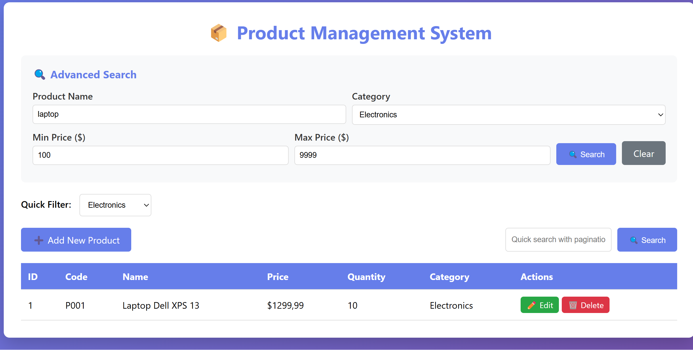
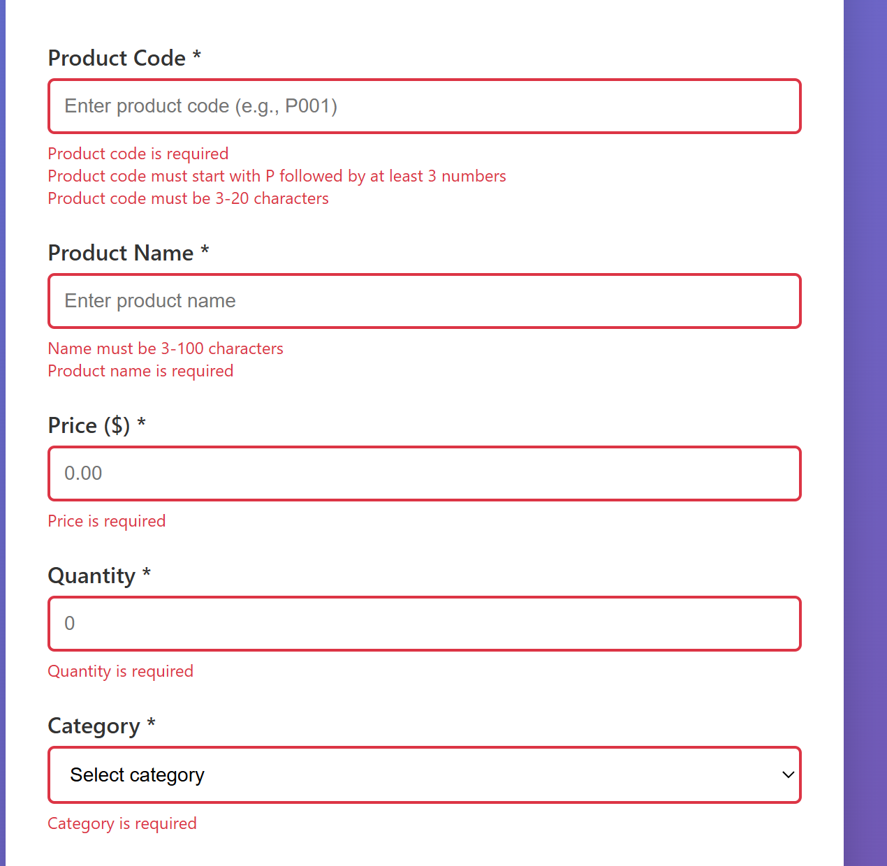
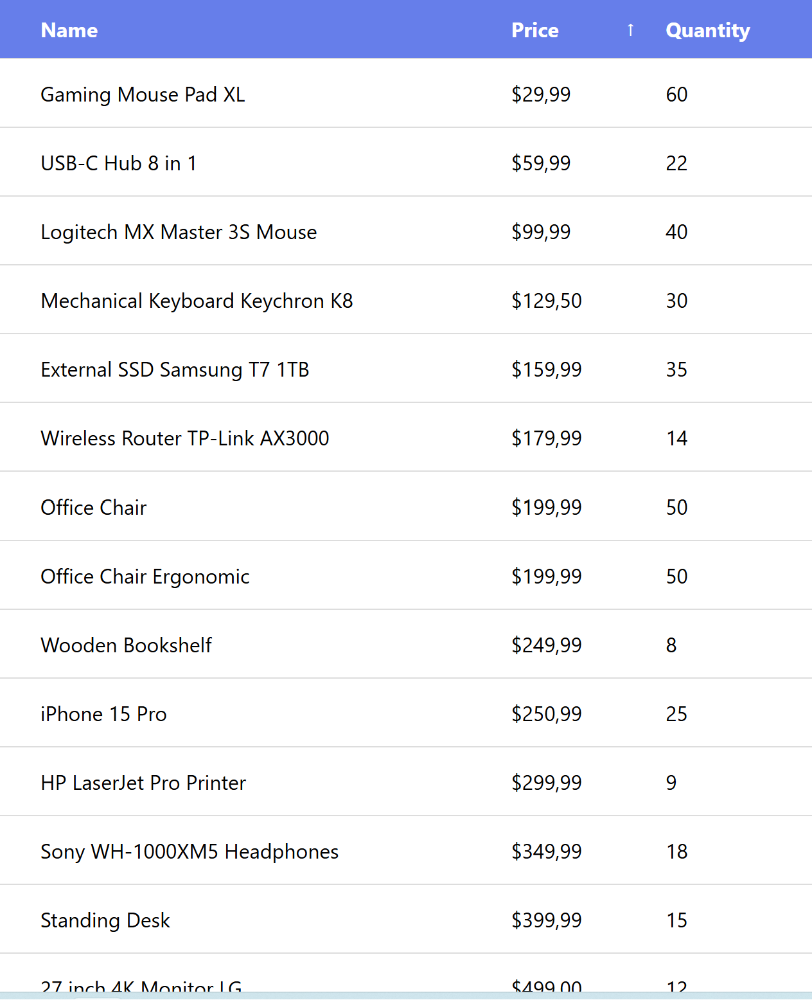
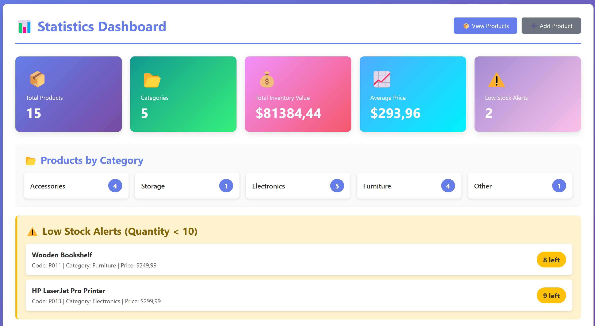

# EXERCISE 5: ADVANCED SEARCH 

- Task 5.1: Multi-Criteria Search 

- Task 5.2: Category Filter 

- Task 5.3: Search with Pagination 

# EXERCISE 6: VALIDATION 

- Task 6.1: Add Validation Annotations

- Task 6.2: Add Validation in Controller

- Task 6.3: Display Validation Errors

# EXERCISE 7: SORTING & FILTERING

- Task 7.1: Add Sorting

- Task 7.2: Filter by Category

- Task 7.3: Combined Sorting and Filtering

# EXERCISE 8: STATISTICS DASHBOARD

- Task 8.1: Add Statistics Methods

- Task 8.2: Create Dashboard Controller

- Task 8.3: Create Dashboard View

